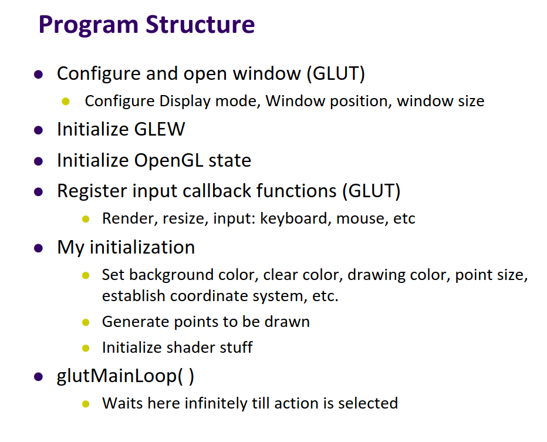

# Opengl concepts
## opengl pipeline
::: mermaid
graph LR;
    A[vertices]-->B[vertix processor];
    B-->C[clipper and primitive assembler];
    C-->D[rasterizer];
    D-->E[fragment processor];
    E-->F[pixels];
:::

## by lectures(slides)
starting code in http://web.cs.wpi.edu/~emmanuel/courses/cs543/f11/slides/lecture01_p2.pdf
1)  